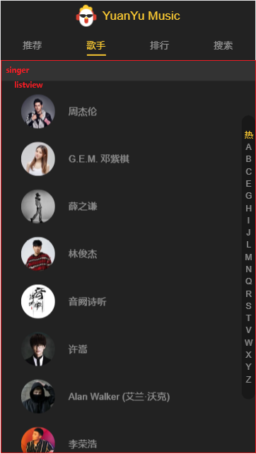
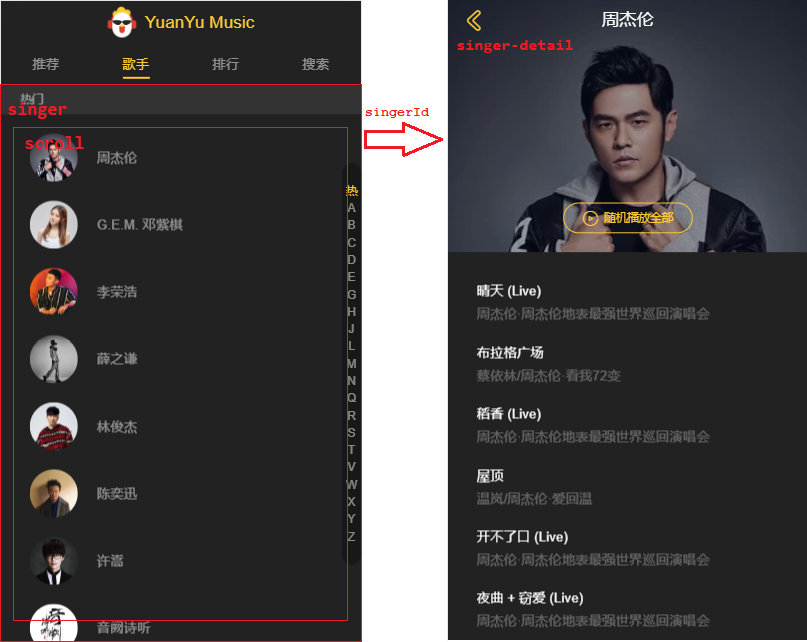

# 1.推荐页面


## 1.1 轮播图

<http://localhost:8848/recommend/picture>

```json
{
    "code": 0,
    "data": [
        {
            "imgUrl": "http://y.gtimg.cn/music/common/upload/MUSIC_FOCUS/1876408.jpg",
            "linkUrl": "https://y.qq.com/n/yqq/album/001TbRMw3bOWUK.html"
        },
        {
            "imgUrl": "http://y.gtimg.cn/music/common/upload/MUSIC_FOCUS/1873962.jpg",
            "linkUrl": "https://y.qq.com/n/yqq/album/0036Ue1l4K8s3c.html"
        }
    ]
}
```


```
https://u.y.qq.com/cgi-bin/musicu.fcg?-=recom9681184374767442&g_tk=5381&loginUin=0&hostUin=0&format=json&inCharset=utf8&outCharset=utf-8&notice=0&platform=yqq.json&needNewCode=0&data=%7B%22comm%22%3A%7B%22ct%22%3A24%7D%2C%22category%22%3A%7B%22method%22%3A%22get_hot_category%22%2C%22param%22%3A%7B%22qq%22%3A%22%22%7D%2C%22module%22%3A%22music.web_category_svr%22%7D%2C%22recomPlaylist%22%3A%7B%22method%22%3A%22get_hot_recommend%22%2C%22param%22%3A%7B%22async%22%3A1%2C%22cmd%22%3A2%7D%2C%22module%22%3A%22playlist.HotRecommendServer%22%7D%2C%22playlist%22%3A%7B%22method%22%3A%22get_playlist_by_category%22%2C%22param%22%3A%7B%22id%22%3A8%2C%22curPage%22%3A1%2C%22size%22%3A40%2C%22order%22%3A5%2C%22titleid%22%3A8%7D%2C%22module%22%3A%22playlist.PlayListPlazaServer%22%7D%2C%22new_song%22%3A%7B%22module%22%3A%22newsong.NewSongServer%22%2C%22method%22%3A%22get_new_song_info%22%2C%22param%22%3A%7B%22type%22%3A5%7D%7D%2C%22new_album%22%3A%7B%22module%22%3A%22newalbum.NewAlbumServer%22%2C%22method%22%3A%22get_new_album_info%22%2C%22param%22%3A%7B%22area%22%3A1%2C%22sin%22%3A0%2C%22num%22%3A10%7D%7D%2C%22new_album_tag%22%3A%7B%22module%22%3A%22newalbum.NewAlbumServer%22%2C%22method%22%3A%22get_new_album_area%22%2C%22param%22%3A%7B%7D%7D%2C%22toplist%22%3A%7B%22module%22%3A%22musicToplist.ToplistInfoServer%22%2C%22method%22%3A%22GetAll%22%2C%22param%22%3A%7B%7D%7D%2C%22focus%22%3A%7B%22module%22%3A%22QQMusic.MusichallServer%22%2C%22method%22%3A%22GetFocus%22%2C%22param%22%3A%7B%7D%7D%7D
```

```json
{
    "comm": {
        "ct": 24
    },
    "category": {
        "method": "get_hot_category",
        "param": {
            "qq": ""
        },
        "module": "music.web_category_svr"
    },
    "recomPlaylist": {
        "method": "get_hot_recommend",
        "param": {
            "async": 1,
            "cmd": 2
        },
        "module": "playlist.HotRecommendServer"
    },
    "playlist": {
        "method": "get_playlist_by_category",
        "param": {
            "id": 8,
            "curPage": 1,
            "size": 40,
            "order": 5,
            "titleid": 8
        },
        "module": "playlist.PlayListPlazaServer"
    },
    "new_song": {
        "module": "newsong.NewSongServer",
        "method": "get_new_song_info",
        "param": {
            "type": 5
        }
    },
    "new_album": {
        "module": "newalbum.NewAlbumServer",
        "method": "get_new_album_info",
        "param": {
            "area": 1,
            "sin": 0,
            "num": 10
        }
    },
    "new_album_tag": {
        "module": "newalbum.NewAlbumServer",
        "method": "get_new_album_area",
        "param": {}
    },
    "toplist": {
        "module": "musicToplist.ToplistInfoServer",
        "method": "GetAll",
        "param": {}
    },
    "focus": {
        "module": "QQMusic.MusichallServer",
        "method": "GetFocus",
        "param": {}
    }
}
```

```json
{
	"focus": {
		"module": "QQMusic.MusichallServer",
		"method": "GetFocus",
		"param": {}
	}
}
```

## 1.2 热门歌单

<http://localhost:8848/recommend/songList>

```json
{
    "code": 0,
    "data": [
        {
            "imgurl": "http://qpic.y.qq.com/music_cover/Uj77DagTFgiccudSicYvppRrbxf0qWnIsJ7icREw8WkrZliahJ8IKw3pLw/300?n=1",
            "name": "Lee BG嗷柏",
            "desc": "Hi-NRG：高能量迪斯科",
            "id": "7300237199"
        },      
        {
            "imgurl": "http://qpic.y.qq.com/music_cover/QZ7tq786GFicI8CAYxeibnamvicpNelTib2TdK7E4s5fTibZE2t2VkYKZ5g/300?n=1",
            "name": "醉枫染墨",
            "desc": "六朝古都 · 十里南京灯火灿",
            "id": "7217581917"
        }
    ]
}
```


```json
{
	"comm": {
	"ct": 24
	},
		"recomPlaylist": {
		"method": "get_hot_recommend",
		"param": {
		"async": 1,
		"cmd": 2
	},
	"module": "playlist.HotRecommendServer"
	}
}
```


```
https://u.y.qq.com/cgi-bin/musicu.fcg?-=recom9681184374767442&g_tk=5381&loginUin=0&hostUin=0&format=json&inCharset=utf8&outCharset=utf-8&notice=0&platform=yqq.json&needNewCode=0&data={%20%22comm%22:%20{%20%22ct%22:%2024%20},%20%22recomPlaylist%22:%20{%20%22method%22:%20%22get_hot_recommend%22,%20%22param%22:%20{%20%22async%22:%201,%20%22cmd%22:%202%20},%20%22module%22:%20%22playlist.HotRecommendServer%22%20}%20}
```


# 2.歌手页面



## 2.1 热门歌手/歌手分类 

<http://localhost:8848/singer/list>


```json
{
    "code": 0,
    "data": [
        {
            "key": "热门",
            "list": [
                {
                    "id": "4558",
                    "name": "周杰伦",
                    "avatar": "http://y.gtimg.cn/music/photo_new/T001R150x150M0000025NhlN2yWrP4.webp",
                    "firstCharName": "Z"
                },
                {
                    "id": "1473880",
                    "name": "陈雪凝",
                    "avatar": "http://y.gtimg.cn/music/photo_new/T001R150x150M000004V53Ga0bV65j.webp",
                    "firstCharName": "C"
                }
            ]
        },
        {
            "key": "A",
            "list": [
                {
                    "id": "944940",
                    "name": "Alan Walker (艾兰·沃克)",
                    "avatar": "http://y.gtimg.cn/music/photo_new/T001R150x150M0000020PeOh4ZaCw1.webp",
                    "firstCharName": "A"
                },
                {
                    "id": "158556",
                    "name": "阿肆",
                    "avatar": "http://y.gtimg.cn/music/photo_new/T001R150x150M000003VJ4nP0Q19xJ.webp",
                    "firstCharName": "A"
                }
            ]
        },
        {
            "key": "C",
            "list": [
                {
                    "id": "1473880",
                    "name": "陈雪凝",
                    "avatar": "http://y.gtimg.cn/music/photo_new/T001R150x150M000004V53Ga0bV65j.webp",
                    "firstCharName": "C"
                },
                {
                    "id": "39000",
                    "name": "Charlie Puth (查理·普斯)",
                    "avatar": "http://y.gtimg.cn/music/photo_new/T001R150x150M000000jnR7q3pCzYG.webp",
                    "firstCharName": "C"
                }
            ]
        },
        {
            "key": "Z",
            "list": [
                {
                    "id": "4558",
                    "name": "周杰伦",
                    "avatar": "http://y.gtimg.cn/music/photo_new/T001R150x150M0000025NhlN2yWrP4.webp",
                    "firstCharName": "Z"
                },
                {
                    "id": "219",
                    "name": "张敬轩",
                    "avatar": "http://y.gtimg.cn/music/photo_new/T001R150x150M000003AfDK34H82GU.webp",
                    "firstCharName": "Z"
                }
            ]
        }
    ]
}
```

musicu.fcg

```
https://u.y.qq.com/cgi-bin/musicu.fcg?-=getUCGI6116488249138035&g_tk=5381&loginUin=0&hostUin=0&format=json&inCharset=utf8&outCharset=utf-8&notice=0&platform=yqq.json&needNewCode=0&data=%7B%22comm%22%3A%7B%22ct%22%3A24%2C%22cv%22%3A0%7D%2C%22singerList%22%3A%7B%22module%22%3A%22Music.SingerListServer%22%2C%22method%22%3A%22get_singer_list%22%2C%22param%22%3A%7B%22area%22%3A-100%2C%22sex%22%3A-100%2C%22genre%22%3A-100%2C%22index%22%3A-100%2C%22sin%22%3A0%2C%22cur_page%22%3A1%7D%7D%7D
```

```json
{
    "comm": {
        "ct": 24,
        "cv": 0
    },
    "singerList": {
        "module": "Music.SingerListServer",
        "method": "get_singer_list",
        "param": {
            "area": -100,
            "sex": -100,
            "genre": -100,
            "index": -100,
            "sin": 0,
            "cur_page": 1
        }
    }
}
```


## 2.2 获取指定歌手的所有歌曲




musicu.fcg

```
https://u.y.qq.com/cgi-bin/musicu.fcg?-=getSingerSong9032856280407204&g_tk=5381&loginUin=0&hostUin=0&format=json&inCharset=utf8&outCharset=utf-8&notice=0&platform=yqq.json&needNewCode=0&data=%7B%22comm%22%3A%7B%22ct%22%3A24%2C%22cv%22%3A0%7D%2C%22singerSongList%22%3A%7B%22method%22%3A%22GetSingerSongList%22%2C%22param%22%3A%7B%22order%22%3A1%2C%22singerMid%22%3A%22002J4UUk29y8BY%22%2C%22begin%22%3A0%2C%22num%22%3A10%7D%2C%22module%22%3A%22musichall.song_list_server%22%7D%7D
```

```
需要media_mid 后面拼接歌曲的url需要
singerSongList data songList[i] file media_mid
```


```json
{
    "comm": {
        "ct": 24,
        "cv": 0
    },
    "singerSongList": {
        "method": "GetSingerSongList",
        "param": {
            "order": 1,
            "singerMid": "002J4UUk29y8BY",
            "begin": 0,
            "num": 10
        },
        "module": "musichall.song_list_server"
    }
}
```


### 2.2.1 获取vkey拼接歌曲的url

```
薛之谦: 002J4UUk29y8BY
演员: 001Qu4I30eVFYb
```

```json
演员
https://u.y.qq.com/cgi-bin/musicu.fcg?-=getplaysongvkey13038739389900833&g_tk=5381&loginUin=0&hostUin=0&format=json&inCharset=utf8&outCharset=utf-8&notice=0&platform=yqq.json&needNewCode=0&data=%7B%22req%22%3A%7B%22module%22%3A%22CDN.SrfCdnDispatchServer%22%2C%22method%22%3A%22GetCdnDispatch%22%2C%22param%22%3A%7B%22guid%22%3A%222822634809%22%2C%22calltype%22%3A0%2C%22userip%22%3A%22%22%7D%7D%2C%22req_0%22%3A%7B%22module%22%3A%22vkey.GetVkeyServer%22%2C%22method%22%3A%22CgiGetVkey%22%2C%22param%22%3A%7B%22guid%22%3A%222822634809%22%2C%22songmid%22%3A%5B%22001Qu4I30eVFYb%22%5D%2C%22songtype%22%3A%5B0%5D%2C%22uin%22%3A%220%22%2C%22loginflag%22%3A1%2C%22platform%22%3A%2220%22%7D%7D%2C%22comm%22%3A%7B%22uin%22%3A0%2C%22format%22%3A%22json%22%2C%22ct%22%3A24%2C%22cv%22%3A0%7D%7D
```


```json
req_0 param songmid
{
    "req": {
        "module": "CDN.SrfCdnDispatchServer",
        "method": "GetCdnDispatch",
        "param": {
            "guid": "2822634809",
            "calltype": 0,
            "userip": ""
        }
    },
    "req_0": {
        "module": "vkey.GetVkeyServer",
        "method": "CgiGetVkey",
        "param": {
            "guid": "2822634809",
            "songmid": [
                "001Qu4I30eVFYb"
            ],
            "songtype": [
                0
            ],
            "uin": "0",
            "loginflag": 1,
            "platform": "20"
        }
    },
    "comm": {
        "uin": 0,
        "format": "json",
        "ct": 24,
        "cv": 0
    }
}
```


```


得到vkey
req_0   data  midurlinfo[0] vkey

http://ws.stream.qqmusic.qq.com/C400003mBrF72dILfK.m4a?guid=2822634809&vkey=A18FA98AEAB424E8CA06658FE07615BB65FB8DB874B311A2BC0F887B9D182588939364BA5D002C297E4385E79C7AFAD21122290AB1C6186C&uin=0&fromtag=66

第一个参数为media_mid第二个为vkey
http://ws.stream.qqmusic.qq.com/C400???.m4a?guid=2822634809&vkey=???&fromtag=66


返回多个服务器地址
req data sip


```


获取歌词

```
fcg_query_lyric_new.fcg

-: MusicJsonCallback_lrc
pcachetime: 1575633616642
songmid: 001Qu4I30eVFYb
g_tk: 5381
loginUin: 0
hostUin: 0
format: json
inCharset: utf8
outCharset: utf-8
notice: 0
platform: yqq.json
needNewCode: 0
```

```
Accept: application/json, text/javascript, */*; q=0.01
Origin: https://y.qq.com
Referer: https://y.qq.com/portal/player.html
Sec-Fetch-Mode: cors
User-Agent: Mozilla/5.0 (Windows NT 10.0; WOW64) AppleWebKit/537.36 (KHTML, like Gecko) Chrome/78.0.3887.7 Safari/537.36
```


